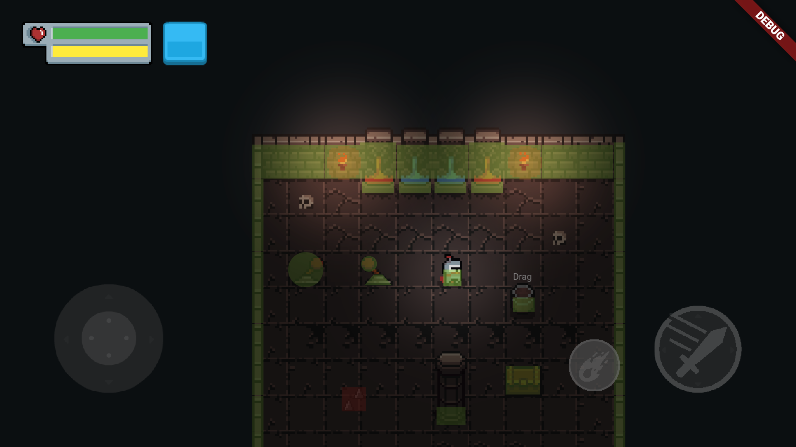

# Collision System

> System responsible for determining and configuring the collision between objects


## How to Use

To enable collisions in your components, add the `ObjectCollision` mixin to the component and configure it using the `setupCollision()` method:

```dart

class MyCustomDecoration extends GameDecoration with ObjectCollision {
  MyCustomDecoration(Position position)
      : super.withAnimation(
          Future<SpriteAnimation>(),
          width: 32,
          height: 32,
          position: position,
        ){
            setupCollision(
                CollisionConfig(
                    collisionOnlyVisibleScreen: true,
                    enable: true,
                    collisions: [ //required
                        CollisionArea.rectangle(
                            size: Size(32,32),
                            align: Vector2(0,0),
                        ),
                    ],
                ),
            );
        }

}
```


## Types of shapes available

There are 3 types of Collision Shapes available: 

- `Rectangle`
- `Circle`
- `Polygon`

```dart
    // Rectangle
    CollisionArea.rectangle(
        size: Size(32,32),
        align: Vector2(0,0),
    ),  

    // Circle
    CollisionArea.circle(
        radius: 16,
        align: Vector2(0,0),
    ), 

    // Polygon
    CollisionArea.polygon(
        points: [
            Vector2(25, 0),
            Vector2(31, 18),
            Vector2(50, 18),
            Vector2(34, 31),
            Vector2(40, 50),
            Vector2(25, 38),
            Vector2(10, 50),
            Vector2(14, 31),
            Vector2(0, 18),
            Vector2(18, 18),
        ],
        align: Vector2(0,0),
    ), 
```

## Knowing who crashed

You can know what `GameComponent` collided by overriding `void onCollision(GameComponent component, bool active)`:


```dart

class MyCustomDecoration extends GameDecoration with ObjectCollision {
  MyCustomDecoration(Position position)
      : super.withAnimation(
          Future<SpriteAnimation>(),
          width: 32,
          height: 32,
          position: position,
        ){
            setupCollision(
                CollisionConfig(
                    collisionOnlyVisibleScreen: true,
                    enable: true,
                    //required
                    collisions: [ 
                        CollisionArea.rectangle(
                            size: Size(32,32),
                            align: Vector2(0,0),
                        ),
                    ],
                ),
            );
        }

    @override
    void onCollision(GameComponent component, bool active) {
       
        if (component is Player) {
            print('Player collided!');
            // Do anything you want
        }

        // active = true : this component enter in collision with param component 
        // active = false : param component enter in collision with this
        super.onCollision(component, active);
    }

}
```

## Testing and debugging

To verify if collisions are in the right position, you can enable `showCollisionArea` in `BonfireTiledWidget`:

```dart
    BonfireTiledWidget(
        ...
        showCollisionArea:true,
        ...
    ),
```


